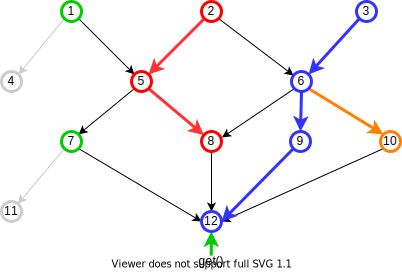
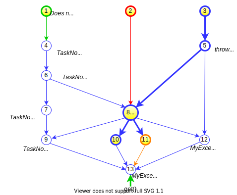

# BascomTask
There are many ways in Java to express parallelized units of work that reach out to external sources such as services
or datastores. There are also complexities to manage that can quickly make such code difficult to manage and change.
The mechanisms of object orientation can be a great aid for making this more manageable: each integration point can 
be split into its own task object. Several benefits accrue from this division of labor:

* Enforcing separation of concerns between tasks
* Unifying cross-cutting capabilities such as logging and exception handling across tasks
* Parallel execution among tasks that can be time-wise expensive on their own 

To make this work, a means to wire tasks together (what are the tasks, what are their dependencies) must be 
provided along with orchestration (executing tasks in parallel such that tasks supplying values are executed prior 
to tasks consuming those values). BascomTask is a lightweight task orchestration library that provides these
mechanisms. Its features include:

* **Implicit dependency analysis** based on Java static typing -- dependencies are computed from method signatures without additional programmer effort 
* **Optimal thread management** that spawns threads automatically only when it is advantageous to do so
* **Lazy execution** that automatically determines what to execute while freely allowing the execution graph to be extended at any time 
* **Fully asynchronous operation** that compliments and integrates fully with Java 8+ CompletableFutures
* **Smart exception handling and rollback** that is customizable and minimizes wasteful task execution
* **Extensible task execution wrappers** with pre-existing built-ins for logging and profiling


## Creating a Task
To work within BascomTask, a task class can be any Java class that (a) has an interface and (b) that interface 
extends the BascomTask _TaskInterface_. There are no method implementations required when extending TaskInterface, 
it is simply a marker interface used by the BascomTask framework that also provides some useful default operations
that will be explained later on. An example of a simple task interface and class with one method that takes and returns
its argument might be:

```java
    import com.ebay.bascomtask.core.TaskInterface;

    public interface IEchoTask extends TaskInterface<IEchoTask> {
        String echo(String s);
    }

    public class EchoTask implements IEchoTask {
        public String echo(String s) { return s; }
    }
```

Notice how the generic parameter to TaskInterface is the interface itself (IEchoTask in this example). 

> The requirements to task-enable any POJO into a task are minimal: implement a marker interface (TaskInterface) that 
> has no methods that need to be overridden. There are no other requirements or restrictions on task classes.
> Task methods can have any number and type of parameter, and there can be any number of task methods on a class. 
> The task class may be stateful or not, depending on programming needs.

## Invoking a Task
The example above can be invoked as follows. On the left, for reference, is how we would invoke the task using only
Java code. On the right the same task invocation is run through BascomTask:

| Line | Plain Java | With BascomTask |
| --- | ----------------------------- | --------------------- |
1 | ... | Orchestrator $ = Orchestrator.create();
2 | String msg =  new EchoTask().echo("hello"); | String msg = $.task(new EchoTask()).echo("hello");

The difference is that instead of invoking the task method directly on the user POJO, that POJO is first added to
a BascomTask Orchestrator before being invoked ('$' as the Orchestrator variable name is a just a convention for
readability). The benefit for this extra effort, in this simple example, is only that 
the task is managed by the framework and facilities such as logging and profiling apply. 
More useful examples involve multiple tasks and parallelism.

## Parallel Hello World
The first step toward parallelism is to employ CompletableFutures as the medium of exchange among tasks, which
maximizes opportunities for mapping different tasks to different threads. This is illustrated in the following 
modification of the previous example that includes an additional task for combining space-separated strings. 
We could have simple added the _combine()_ method same _EchoTask_ (a single task can have multiple diverse methods), 
but for clarity they are separated in this example:

```java
    public interface IEchoTask extends TaskInterface<IEchoTask> {
        CompletableFuture<String> echo(String s);
    }
    
    public class EchoTask implements IEchoTask {
        public CompletableFuture<String> echo(String s) { return complete(s); }
    }
    
    public interface ICombinerTask extends TaskInterface<ICombinerTask> {
        CompletableFuture<String> combine(CompletableFuture<String> a, CompletableFuture<String> b);
    }

    public class CombinerTask implements ICombinerTask {
        public CompletableFuture<String> combine(CompletableFuture<String> a, CompletableFuture<String> b) {
            return complete(get(a) + ' ' + get(b));
        }
    }
```
The above makes calls to _get()_ and _complete()_, which are convenience methods defined in _TaskInterface_ 
for getting and setting values from/to CompletableFutures. These are examples of convenience methods, not otherwise
mandatory, defined on _TaskInterface_

With the above task definitions in place, we can wire them together like this:

```java
   import com.ebay.bascomtask.core.Orchestrator;

   class MyService {
       String getMessage() {
           Orchestrator $ = Orchestrator.create();
           CompletableFuture<String> left = $.task(new EchoTask()).echo("Hello");
           CompletableFuture<String> right = $.task(new EchoTask()).echo("world");
           CompletableFuture<String> combine = $.task(new CombinerTask()).combine(left, right);
           return cmobine.get();
       }
   }
```
With this wiring, the left and right echo tasks will be executed in parallel and when they both complete then 
(and only then) the CombinerTask will be executed. This works because the actual execution does start until the 
_get()_ call. The framework works backward from the _get()_ call, recursively determining all the tasks that are 
required to complete that call, then initiates execution such that any task's inputs are executed prior to it being 
started. Because of this lazy execution, it is not costly to create many tasks and only later determine which ones 
are needed; the framework will determine the minimal spanning set of tasks to actually execute, and then proceed in a 
dataflow-forward execution style, executing tasks once (and only when) all their inputs are available 
and completed. 

> Since the dependency analysis is determined from the method signatures themselves, it is not possible
to mistakenly execute a task before its parameters are ready.


## General Programming Model
1) Task methods on are activated (scheduled for execution) on demand by a call to execute, get, or other access
   operation on a CompletableFuture returned from a task method. 
2) Activation works recursively backward, activating that task method and all its predecessors (incoming arguments).
3) Task methods that are ready to fire (begin execution), either because all their CompletableFuture inputs have
   already completed or because they have no CompletableFuture inputs, are collected. 
4) All except one are spawned to new threads and all are started (one is kept for execution by the processing thread). 
5) Completion runs forward. Each completion checks for each of its dependents whether that dependent has all its 
   arguments ready. All _those_ ready-to-fire task methods are collected.
6) Return to step 4. 

> Without any extra programming effort, the framework determines what tasks can be executed in parallel.

The following diagram illustrates the thread flow among 12 task method invocations (circles) activated by a
get() call, with execution color-coded with the thread (there are 4 in this example) that executes them:



The conventions in this diagram are:

* Circles are task method invocations
* Arrows are forward dependencies (the task method on the arrow end take the other task method's output as a parameter)
* Task methods that are executed have a thick outline
* Arrows have a thick line when they are the final argument that completes all the target inputs
* Yellow fill in a task-method circle indicate that a value was returned and no exception was generated
  (in the example above, there were no exceptions but there will be in a later diagram)
* A gray outline means the task method was never activated, so it was never executed
* Otherwise, the color codes represent threads, of which there are 4 above indicated by green, red, blue, and orange; 
  the calling thread in this example is green while the others are spawned by the framework

The incoming request comes through the green thread that calls _get()_ on task 12. To compute its result, all the
non-gray tasks (excluding 4 and 11) are required. The ones with no incoming paths (1, 2, and 3) are executed first,
and since there are three of them and only one thread (the green calling thread), two threads are spawned (red and
blue) to execute tasks 2 and 3. 

All the other tasks have input arguments that are all CompletableFutures in this example. As each of those arguments 
is completed, a check is made for all dependent tasks that have all their arguments completed and ready. Just 
one of the predecessor tasks, the last one to complete, will result in the dependent task firing. This is indicated 
by the think lines in the diagram above.

Task 5 has two incoming arguments, and assuming task 2 is slower than task 1 then task
5 cannot execute until task 2 is complete. The green thread, which is the main thread, waits. When task 5 completes
it feeds into 7 and 8 and assuming task 6 has completed then both of 7 and 8 are ready to execute. Since the red task
can only execute one of them it looks to spawn a thread but since the main thread is waiting it simply reuses that
thread, hence task 7 is executed by the green thread. The same need occurs upon completion of task 6, but since there is
no main thread waiting it spawns an orange 4th thread for task 10. The final task 12 is executed by the blue thread,
assuming it arrives as the last argument for task 12. The result is now available to return to the original green
thread caller.

## More on Activation
In BascomTask, task methods are not executed until activated, which occurs once, the first time any one of the
following actions occurs on the CompletableFuture returned from a task method:
<ol type="a">
<li>Accessing its value through get(), getNow(), or join()
<li>Passing it to one of several variations of execute() defined on Orchestrator
<li>Being passed as input to another task method that is activated
<li>The task wrapper is marked with activate() (see below)
</ol>

The options in (a) are simply convenience operations that call execute() internally. These save you from having to always
invoke execute() prior (for example) to get(). This makes intuitive sense and prevents errors, since there is never
any point to attempting to get() a value from a task method that has not been activated and will not therefore execute,
leaving the get() call to block indefinitely.

Convenience aside, (b) provides the most general and flexible form of activating task methods, notably allowing
for multiple activations at the same time. If, for example, you otherwise simply call _f1.get()_ followed by a call 
to _f2.get()_, _f2_ won't be activated until _f1_ completes. While there is no functional impact to doing that, it 
might not be as efficient as activating them both at the same time with a single call to  _execute(f1,f2)_.

There is additional functionality available with execute methods. There are four types, each with optional timeout 
arguments and varargs and list variations:
* _execute_ activates multiple values at once, without (necessarily) waiting</li>
* _executeAndWait_ activates multiple values at once and does not return until all are complete</li>
* _executeFuture_ activates multiple values at once and returns a CompletableFuture that asynchronously completes
when all of its inputs complete
* _executeAsReady_ activates multiple values at once and returns results independently and incrementally
as soon as they complete

> There is no harm in calling _execute()_ multiple times with the same or different arguments, nor for calling both 
> execute and get for a given CompletableFuture. The execution graph can also be freely extended at any time, even 
> in a nested task, in a thread-safe manner with any of these calls.

### Comparing BascomTask Futures with Standard CompletableFutures
The BascomTask model of activation has implications as compared with using CompletableFutures alone. For example,
consider some _ConcatTask_ class with a string _concat_ method (not otherwise shown). Using only CompletableFutures, 
the _concat_ method below will be called and _cfw_ --regardless of whether it is accessed or not-- will be completed 
with a value of "hello world":

```java
CompletableFuture cfh = CompletableFuture.supplyAsync(() -> "hello");
CompletableFuture cfw = cf.thenApply(s->concatTask.concat(s," world"));
```

In contrast, the concat method in the BascomTask version below will not be executed because it is not activated,
even though its input argument _cfh_ completes:

```java
CompletableFuture cfh = CompletableFuture.supplyAsync(() -> "hello");
CompletableFuture cfw = $.task(concatTask).concat(cfh," world");
```

This illustrates that BascomTask is a compliment to, rather than an alternative to, CompletableFutures. If you want 
the first behavior, just use CompletableFutures. If want the lazy task/activation behavior, use BascomTask. 
BascomTask is completely compatible with CompletableFutures, and they can be freely intermixed. For some programs, 
a predominantly CompletableFuture program might mix in an occasional use of BascomTask,
while for other programs that balance might be reversed.

Nonetheless, it is important to keep in mind that BascomTask CompletableFutures must be activated in some way before 
they can be chained. For example, in the following:

```java
$.task(concatTask).concat(cfh," world").thenAccept(System.out::println);
```

No output would be printed, because the CompletableFuture returned by _concat_ has not been activated
according the rules listed earlier. _CompletableFuture.thenAccept()_ or any similar call has no effect on anything that
comes before it in a processing chain, whether using CompletableFutures only or in conjunction with BascomTask,
so the _concat_ task method that started out unactivated remains unactivated. Activation could be effected by splitting 
this one line into several  and passing the CompletableFuture to _Orchestrator.execute()_ prior to invoking 
_thenAccept()_ on it, but a simpler way is to let TaskInterface.activate() do that for you. That is simply another 
convenience method that allows everything to remain as one expression:

```java
$.task(concatTask).activate().concat(cfh," world").thenAccept(System.out::println);
```

### External CompletableFutures
CompletableFutures that originate externally to BascomTask can be used as task method arguments just like any 
BascomTask-managed CompletableFutures. BascomTask-managed CompletableFutures can be used externally to BascomTask 
just like any other CompletableFuture. BascomTask thus fits naturally into any asynchronous execution scheme.

In this simple (though not very useful) example, a CompletableFuture from some other source is fed into a task and that
output through a thenApply function:
```
    CompletableFuture<Integer> fromSomewereElse = ..
    CompletableFuture<integer> result = $.task(new MyTask()).computeSomething(fromSomwhereElse))).thenAccept(v->doSomethingWith(v));
```
The CompletableFuture result will now reflect having applied MyTask.computeSomething to the fromSomewhereElse value.

## Conditional Execution

At times the choice of a task may vary based on some runtime condition. At the simplest
level, the condition is known during graph construction, allowing a simple choice of task implementations e.g.:

```
   boolean cond = ...
   CompletableFuture f1 = cond ? $.task(new Task1()).compute1(...) : $.task(new Task2()).compute2(...);
```
Sometimes, however, the condition itself must be executed by a task. While you can compute _cond_ by a _get()_ on
the task method the produces the boolean condition, that would block until completed, and you may not even want
the entire conditional block to be executed in the first place. That could be avoided by moving the conditional logic 
itself to its own task, but BascomTask already provides a convenience form for. Suppose we have a task 
_SomeConditionTask_ with a method that produces a boolean result, then the following can be applied:

```
   CompletableFuture<Boolean> cond = $.task(new SomeConditionTask()).computeCondition(...);
   CompletableFuture<Integer> firstChoice = $.task(new Task1()).compute1(...);
   CompletableFuture<Integer> secondChoide = $.task(new Task2()).compute2(...);
   CompletableFuture<Integer> resolved = $.cond(cond,firstChoice,secondChoice);
   int got = resolved.get();
```
In this example, once _computeCondition()_ completes, then either _Task1.compute1()_ or _Task2.compute2_ will be 
executed. Because the _resolved_ value is requested (through the _get()_ call), then _cond_ task is required, 
and once complete then either _Task1.compute_ or _Task2.compute_ is executed. 

While that call to _cond()_ efficiently avoids executing either the _then_ or _else_ choice that will not be used,
it may be more desirable in some cases to start either of those result tasks at the same time as the condition task 
so that when the condition is ready the result tasks are also ready or at least have already been started.
The _cond()_ call has an alternate form for this purpose that allows booleans to be specified indicating this intent:

```
   CompletableFuture<Integer> resolved = $.cond(cond,firstChoice,true,secondChoice,true);
```
The _true_ values in this example indicate that the tasks behind each of firstChoice and secondChoice should be 
started at the same time as the task behind _cond_.

> BascomTask can reduce the proliferation of repeated if-then-else statements in task wiring, since the expression
> of dependencies is not tied to a decision to actually execute a task method. Conditional logic can be wrapped into
> Conditional expressions and applied only where it influences the logical outcome.

## Function Tasks
Sometimes it is convenient to define a task simply with a lambda function, without having to write separate
a separate class for it. These can be Supplier or Consumer functions, as in the following Suppler lambda 
that return the value 1:

```
   CompletableFuture<Integer> t1 = $.fn(()->1);
```
The call creates the task which is just like any other user POJO task and then invokes its
task method to return a CompletableFuture result. The definition of this fn method Orchestrator is this:

```
    default <R> CompletableFuture<R> fn(Supplier<R> fn) {
        return fnTask(fn).apply();
    }
```
As can be seen, fnTask is the call to make to get the task itself, which you may want to do to apply common
methods on it such as giving it a name or changing its weight -- unlike regular tasks, function tasks are
'light' by default meaning a separate thread will not be spawned for them, but that can be changed as described
later in the configuration section. For must purposes, the simpler and shorter fn() call will likely be sufficient.

There are number of these methods that take different kinds of lambdas, for Supplier as well as Consumer lambdas.
For lambdas that take arguments these must be passed to the fn/fnTask methods in turn, as CompletableFutures. The 
following example takes a value returned from a POJO task method, the hardwired value three, and a BiFunction 
that multiplies them together: 

```
    CompletableFuture f1 = $.task(new MyTask()).computeSomeValue();
    CompletableFuture<Integer> task = $.fn(
            f1,
            ()->3,
            (x,y)->x*y);
```
Consumer functions (producing void results) are called with vfn/vfnTask rather than fn/fnTask. They produce a
CompletableFuture<Void> that _must_ be accessed (e.g. by a get() or execute() call) in order to make the 
function execute. 


### User Task Adaptors
A variation of the _task()_ call can adapt POJO tasks that do not have interfaces and/or do not take or 
return CompletableFutures, For example, assuming we have a simple POJO
```java
   class RetTask {
      int ret(int v) { return v; }
   }
```
Then we can adapt it for use within BascomTask like so:
```
   Cf<Integer> x = $.task( new RetTask().ret(1) );
```
The tradeoff, of course, is that the task execution is completely invisible to BascomTask. A variation exists that
exposes the task to BascomTask that is slightly more helpful for logging and debugging:
```
   Cf<Integer> x = $.task( new RetTask(), t->ret(1) );
```


## Exception Handling
Any exception thrown from a task method is propagated to callers or execute() or to any of the various CompletableFuture 
methods that return values. This occurs even if the exception is generated in any spawned thread, at any level of 
nesting, from predecessor to successor recursively. If you get an exception while trying to perform an operation on a
CompletableFuture, it means that either the immediate task method behind it, or one of its ancestors, generated tha 
exception.

It is sometimes desirable to take action when tasks generate exceptions, such as reverting the side effects of previous 
tasks and/or computing an alternative result. The fate() operation serves this purpose, accepting a variable list of 
CompletableFutures and returning true only when at least one of them generates an exception. The following, for example, 
returns an alternate value if either f1 or f2 have exceptions, but just returns f1 otherwise: 

```
   CompletableFutre<Integer> f1 = $.task(new MyTask1()).computeThing(...);
   CompletableFutre<Integer> f2 = $.task(new MyTask2()).computeOtherThing(...);
   CompletableFuture<Boolean> fate = $.fate(f1,f2);

   CompletableFuture<Integer> alt = $.task(new MyAltTask()).computeAlternate(...);

   f1 = $.cond(fate,alt,f1);
```

Reversion functions can be conditionally applied:

```
   MyTask1 task1 = new MyTask1();
   MyTask2 task2 = new MyTask2();
   CompletableFutre<Integer> f1 = $.task(task1).computeThing(...);
   CompletableFutre<Integer> f2 = $.task(task2).computeOtherThing(...);
   CompletableFuture<Boolean> fate = $.fate(f1,f2);

   if (fate.get()) {
       CompletableFuture<Void> r1 = $.task(task1).revertThing(f1);
       CompletableFuture<Void> r2 = $.task(task2).revertOtherThing(f2);
       $.execute(r1,r2);
   }   
   
```
Grouping task outputs in a fate() call indicates an intention that their success or failure is linked. The action you
take, if any, is up to you, but the framework does an additional bit of optimization: it attempts to prevent from
starting, if they have not already started, all tasks methods that feed into the fate() call. While the fate() call 
does not exit until all its arguments have been processed, unlike regular task methods it does not 
wait for all its arguments to complete -- it recognizes a fault on any of its arguments as soon as it occurs. 
Then, it recursively works backwards attempting to prevent any of its predecessors (from its complete set of arguments) 
from starting if they have not already done so. Since those CompletableFutures should be completed in some way 
(so that any potential readers will not indefinitely block), they are set to complete exceptionally with a 
TaskNotStartedException. Reversion logic need simply check the state of its argument, so for the example above
that might be something like this:

```
  public CompletableFuture<Void> revertThing(CompletableFuture<Integer> myOutoutput) {
    if (!myOutput.isCompletedExceptionally()) {
       // reversion logic here
    }
    return complete();
  }
```

### General Exception Handling Flow
When a task throws an exception:
1. That exception is recursively propagated to all descendents, except for any FateTasks (created by calls to fate()),
which are collected in a list
1. For every collected FateTask,
   1. For every input to that FateTask
      1. For each ancestor task (recursively) that is not executed 
         1. mark it as TaskNotCompleted and propagate recursively to its descendents stopping at any task that either
            1. Is already completed (normally or with some other exception)
            1. Is a FateTask
1. Process the collected FateTasks in the normal manner

The following illustrates the various impacts of exceptions on a complex graph. As before, the tasks methods that 
return a value without exception are filled in yellow. This includes the root tasks 1, 2, and 3 that start and complete 
normally. Task 5 generates an exception and, as a result, a number of other task are set to return an exception and
so do not have a yellow fill. Assuming that task 5 completes (by generating its exception) before task 4 is started, 
the following applies:



In addition to the propagation of MyException to its descendent tasks 12 and 13, task 8 is a call to fate() which
works to cancel other tasks from starting. In this example, task 2 would have already started and may even be
completed so there is nothing to do there, but task 6 has not started. The fate logic works backward
and also finds that task 4 has not started. That is cancelled and set to return a TaskNotStartedException. 
As with any other exception, that task is propagated forward to its descendents. In this example, that results
in tasks 7 and 9 being cancelled; task 13 was already set to complete with the original exception.

With the exception propagation having completed, task 8 itself can now be activated. It has two descendents and,
as with normal execution flow, a thread is spawned (orange) to handle the second one. These feed into task 13,
but that task has already generated an exception and that outcome remains unchanged. The original caller to
get() will see a MyException thrown. Should any call, by this or other threads get() be made on any other 
task method output, the results are fixed: all the yellow-filled task methods will return a valid value while
all the others will throw an Exception that is of the indicated type.


## Configuration

Orchestrators have various configuration options for controlling or extending core behavior. These can be set
on an individual orchestrator or on GlobalOrchestratorConfig.getConfig() which will then copy all of its settings to 
orchestrators when they are created. The GlobalOrchestratorConfig configuration object can also be entirely replaced if desired,
allowing complete control over Orchestrator initialization.

### Customizing the Thread Spawning Strategy

The time and manner of thread spawning can be controlled at multiple levels. At the task level, a test method can
be annotated as @Light, in which case no thread is ever spawned for it. This is useful because the writer of the
task method usually has a pretty good idea about the performance cost of that method. If the task method
implementation is not reaching out to other systems or databases, it should probably be @Light.

During wiring, that (or the default value which is not @Light) can be overridden, either setting it to be light or 
forcing it to always require a new thread to be spawned:

```
  $.task(new MyTask()).light().exec(...);
  $.task(new MyTask()).runSpawned().exec(...);
```

At the Orchestrator and global levels, a SpawnMode can be set that affects all spawning decisions for that or
all Orchestrators. Thread spawning can be always or never used, or only under specified conditions. The role of the 
main (calling) thread can be controlled, whether to be used or reused in task execution. The default is
SpawnMode.WHEN_NEEDED, which is the behavior described earlier this document, but others are available such as
NEVER_SPAWN.

### Task Runners
The execution of each task method can be intercepted/decorated by adding (any number of) TaskRunners to an 
Orchestrator. You can write your own or use a built-in from the BascomTask library:

* LogTaskRunner for logging ingress/egress of tasks
* StatTaskRunner for collecting aggregate timing information across tasks
* ProfilingTaskRunner for generating execution profiles for an Orchestrator

There are several ways to add a TaskRunner:

* Directly to an Orchestrator
* To GlobalOrchestratorConfig.getConfig().first/lastInterceptWith(), in which case that same TaskRunner instance will
  be added to all Orchestrators
* Add an initializer function to GlobalOrchestratorConfig.getConfig().initializeWith() to generate a new TaskRunner
  instance that will be added to all new Orchestrators
* GlobalOrchestratorConfig.interceptFirstOnCreate()/interceptLastOnCreate() which accepts a TaskRunner creation
  function to apply to each created orchestrator

The builtin ProfilingTaskRunner class is a good choice for the latter options, because it maintains state that is
generally only useful in the context of a single Orchestrator (LogTaskRunner, as a contrary example, maintains no 
such state). The following example sets up profiling with this mechanism:

```java
class MyRunner {
    void runWithProfiling() throws Exception {
        try (LaneRunner<ProfilingTaskRunner> laneRunner = GlobalOrchestratorConfig.interceptFirstOnCreate(ProfilingTaskRunner::new)) {
            // ... Invoke code here that might create Orchestrators in this thread
            System.out.println(laneRunner.runners.get(0).format());
        }
    }
}
```
In addition to the options above, the configuration object returned by GlobalOrchestratorConfig.getConfig() can be 
replaced entirely with an instance from a custom class extending the existing configuration class or an entirely 
different one. A use case that leverages this capability might be to pull configuration information from an 
external configuration store.


### Timeouts
CompletableFutures provide a variant of get() that takes timeout arguments. The BascomTask execute and executeWait 
methods, which each take a list of CompletableFutures that should be executed, also take such optional arguments. 
Any of these calls has the same effect of ensuring that the calling thread does not wait longer than the provided 
duration, and throw a java.util.concurrent.TimeoutException if so. 

Threads spawned during execution are not subject to the same timeouts in standard CompletableFutures and by default 
also BascomTask-managed CompletableFutures. What BascomTask will do at a minimum is to ensure that threads created in 
service of a call with an exceeded timeout will not begin execution of new tasks. 

Thread interrupts can be enabled in BascomTask by setting a TimeoutStrategy on an Orchestrator (or globally for all 
Orchestrators), see the TimeoutStrategy enum for options. A timeout value is likewise configurable value and will 
apply to any request that does not itself provide an explicit timeout. For example, a call to CompletableFuture.get() 
without arguments will pick up the timeout set on an Orchestrator if one has been set. By default, 
there is no timeout set. 

Accessing a CompletableFuture whose execution path was spawned and timeout out will result in an exception. This
_may_ be a BascomTask TimeoutExceededException, which unlike java.util.concurrent.TimeoutException is unchecked. 
If interrupts are enabled, the response may be something different if a task has handled the interrupt
and thrown a different exception.


### Change Log 
[here](doc/Changelog.md)

---
## License Information
       
Copyright 2018 eBay Inc.
Author/Developer: Brendan McCarthy
 
Licensed under the Apache License, Version 2.0 (the "License");
you may not use this file except in compliance with the License.
You may obtain a copy of the License at
 
    https://www.apache.org/licenses/LICENSE-2.0
 
Unless required by applicable law or agreed to in writing, software
distributed under the License is distributed on an "AS IS" BASIS,
WITHOUT WARRANTIES OR CONDITIONS OF ANY KIND, either express or implied.
See the License for the specific language governing permissions and
limitations under the License.

